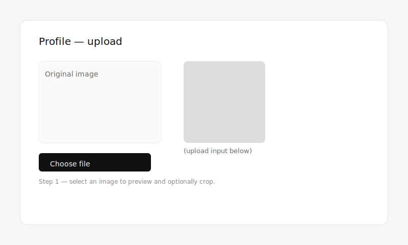

# O'larry — Minimal Photo-Sharing Demo (React + Vite)

O'larry is a compact photo-sharing application built to demonstrate common media workflows using a modern frontend and a small serverless backend. The project purpose is educational: to show how to handle image uploads, simple user flow, and profile avatars with pragmatic, minimal infrastructure.

Table of contents
- Features
- Quick start (frontend)
- Backend (Azure Functions)
- Profile pictures & usernames
- Development notes
- Contributing

---

## Features
- Image uploads with captions and a username field.
- Persistent client-side username (stored in `localStorage`).
- Per-user profile pictures with client-side preview and optional square-cropping.
- Avatars are displayed in the feed; profile-image posts are hidden from the main gallery.
- Automatic cleanup of prior profile images when a new avatar is uploaded.

---

## Quick start (frontend)
Prerequisites: Node.js (16+), npm

1. From the repo root, enter the frontend workspace

   cd frontend

2. Install dependencies

   npm install

3. Start dev server

   npm run dev

4. Open the app in your browser (default: http://localhost:5174)

Notes: Set your username in the Navbar (top-right). Visit `/<your-username>` to upload a profile image and test the avatar flow.

---

## Backend (Azure Functions API)
A companion Azure Functions API powers uploads and listing. The backend code is not included in this repository; the dev proxy in `vite.config.js` points to the hosted API.

Briefly, the backend:
- Stores images in an Azure Blob container (`images`).
- Exposes endpoints for upload, list, like, delete, and AI captioning.
- Returns short-lived SAS URLs for images (used directly in `` tags).

If you bring your own backend, ensure the API surface matches the endpoints below and update `API_PROXY_TARGET` in `vite.config.js` as needed.

---

## Profile pictures & usernames (how it works)
Implementation summary for maintainers:
- The frontend uploads a profile image as a regular media post and tags it by setting `caption=__profile_pic__` on upload.
- The frontend derives avatars by choosing the latest `__profile_pic__` post per username when building the feed or profile header.
- After a successful profile upload, the client issues `DELETE` requests for older `__profile_pic__` posts for that username to keep storage tidy.

Note: The caption-based approach avoids backend changes; for production, consider adding a dedicated profile endpoint to store a single canonical avatar per user and server-side resizing.

---

## Screenshots / Flow
Below are illustrative screenshots that show the profile upload flow (select image → preview/crop → upload). These are intended as visual guidance; feel free to replace them with real app screenshots.

---

## Development notes
- API surface (frontend ↔ backend): `POST /api/upload_media`, `GET /api/list_media`, `POST /api/like_media`, `DELETE /api/delete_media`, `GET /api/ai_caption`.
- Uploads send raw image bytes in the request body; do not use `FormData` or set `Content-Type` manually (backend expects a binary body).
- SAS tokens returned by `list_media` expire (short-lived for security).

---

## Developer checklist & E2E test stub ✅
Use the checklist below to validate the profile upload flow during development; an example Playwright test stub is provided in `tests/e2e/profile-upload.spec.js`.

Checklist:
1. Start backend (`func host start`) and frontend (`npm run dev`).
2. Set a username in the Navbar and confirm it persists (localStorage).
3. Go to `/<your-username>` and select a profile image; verify Original and Cropped previews.
4. Upload the image and verify the profile header updates with the new avatar.
5. Verify older `__profile_pic__` posts for the username are deleted (via `GET /api/list_media`).

Run E2E (Playwright):
- Install Playwright and browsers: `npm i -D @playwright/test && npx playwright install`
- Run tests: `npm run test:e2e`

The stub `tests/e2e/profile-upload.spec.js` demonstrates the flow and includes a note on adding a binary fixture for file upload testing.

---

## UI theme — BAPE matte grey

- Futuristic glass panels, neon accent pulses, and matte grey backdrop across feed, navbar, and upload studio.
- Dev proxy avoids CORS in development: `API_BASE` uses `/api` in dev (see `vite.config.js`), falls back to hosted API for production.
- Typography: Space Grotesk; accents: `--accent` (mint) and `--accent-2` (lavender). Tweak in `src/styles/global.css` if you want a different pop.
- Upload studio: drag/drop zone, glowing preview, progress bar, and pill actions styled in the same palette.

---

## Contributing
Contributions are welcome. Suggested next steps:
- Add server-side profile endpoints and image resizing.
- Add E2E tests for the upload and cleanup flow.
- Add screenshots or a short GIF to the README to illustrate the profile upload flow.

Please open an issue or a pull request with a short description of the change.

---

## License
This repository is provided for educational purposes. Include your preferred license file if you plan to reuse or distribute the project.

---

If you want, I can add screenshots or a short GIF to the README, or expand any section with more technical detail (API examples, curl commands, or a dev checklist).